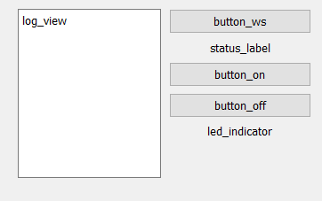

# Звіт до лабораторної роботи №1 з дисципліни "Робототехніка та інтелектуальні системи"

**Виконав:**
Студент групи ПК-51мп
Погорєлов Богдан

**Прийняв:**
Момот А. С.

**Національний технічний університет України
"Київський політехнічний інститут імені Ігоря Сікорського"
2025**

---

## Тема: Створення графічного інтерфейсу для дистанційного керування мікроконтролером

### Мета роботи

Ознайомлення з основами дистанційного керування апаратними компонентами за допомогою Wi-Fi з'єднання, створення графічного інтерфейсу користувача (GUI) на PyQt та організація взаємодії між мікроконтролерами ESP32-CAM і Arduino Uno.

---

### Теоретичні відомості

Система, що розглядається в даній лабораторній роботі, призначена для дистанційного керування світлодіодом на платі Arduino Uno за допомогою комп'ютера через Wi-Fi. Вона складається з трьох ключових компонентів:

1.  **ESP32-CAM**: Виконує роль комунікаційного вузла, забезпечуючи підключення до мережі Wi-Fi та обмін даними через протокол WebSocket. Цей модуль отримує команди від комп'ютера і передає їх на Arduino Uno через послідовний інтерфейс UART.
2.  **Arduino Uno**: Відповідає за виконання отриманих команд, а саме, зміну стану вбудованого світлодіода (увімкнення/вимкнення).
3.  **Програмне забезпечення на ПК**: Графічний інтерфейс, створений за допомогою бібліотеки PyQt, з кнопками для надсилання команд "увімкнути" та "вимкнути", а також для відображення статусу системи.

Принцип роботи полягає у послідовній передачі даних. Користувач надсилає команду через GUI, яка через WebSocket потрапляє на ESP32-CAM. ESP32-CAM перенаправляє цю команду через UART на Arduino Uno, яка виконує дію і надсилає підтвердження назад. Це підтвердження повертається на ПК і відображається в інтерфейсі.

---

### Використане обладнання та програмне забезпечення

**Апаратні компоненти:**
* Мікроконтролер ESP32-CAM
* Мікроконтролер Arduino Uno
* USB-UART перетворювач для програмування ESP32-CAM
* З'єднувальні дроти

**Програмне забезпечення:**
* Arduino IDE для програмування мікроконтролерів.
* Python 3.
* Бібліотека PyQt5 для створення графічного інтерфейсу.
* Qt Designer для візуального проектування інтерфейсу.
* Бібліотеки `websockets` та `asyncio` для реалізації WebSocket-клієнта.
* Бібліотеки `ESPAsyncWebServer` та `AsyncTCP` для реалізації WebSocket-сервера на ESP32.

---

### Хід виконання роботи

#### 1. Програмування мікроконтролера ESP32-CAM

Було створено скетч [esp32Server.ino](ardu/esp32Server/esp32Server.ino), який виконує наступні функції:
-   Підключається до мережі Wi-Fi з SSID "BogWiFi".
-   Створює WebSocket-сервер для обміну даними з клієнтом на ПК.
-   Ініціалізує mDNS для доступу за іменем `http://esp32cam1.local`.
-   Налаштовує другий апаратний UART (Serial1) для зв'язку з Arduino Uno, використовуючи піни 15 (RX) та 14 (TX).
-   При отриманні повідомлень "on" або "off" через WebSocket, пересилає їх на Arduino Uno.
-   Повідомлення, отримані від Arduino Uno, відправляються всім підключеним WebSocket-клієнтам.

#### 2. Програмування мікроконтролера Arduino Uno

Було створено скетч [unoClient.ino](ardu/unoClient/unoClient.ino), який:
-   Ініціалізує програмний UART (SoftwareSerial) для зв'язку з ESP32-CAM через піни 2 (RX) та 3 (TX).
-   Очікує на команди "on" або "off" від ESP32-CAM.
-   При отриманні команди "on", вмикає вбудований світлодіод (пін 13) і надсилає у відповідь повідомлення "OK: LED is ON".
-   При отриманні команди "off", вимикає світлодіод і надсилає повідомлення "OK: LED is OFF".
-   У випадку отримання невідомої команди, надсилає повідомлення про помилку.

#### 3. Створення графічного інтерфейсу на PyQt

За допомогою Qt Designer було створено вікно програми `led_control.ui`, яке містить:
-   Кнопки "Включити світлодіод" (`button_on`) та "Вимкнути світлодіод" (`button_off`).
-   Мітку для відображення статусу з'єднання (`status_label`).
-   Графічний індикатор стану світлодіода (`led_indicator`).
-   Поле для виведення логів (`log_view`).
-   Кнопку для перепідключення до WebSocket (`button_ws`).

#### 4. Написання Python-скрипта для керування

Був створений файл [lw1.py](py/lw1.py), який реалізує логіку роботи GUI:
-   Завантажує інтерфейс з файлу `led_control.ui`.
-   Встановлює асинхронний WebSocket-з'єднання з ESP32-CAM за адресою `ws://10.225.226.26/ws`.
-   При натисканні на кнопки "on" та "off" надсилає відповідні команди на сервер.
-   Оновлює зображення індикатора світлодіода в залежності від відправленої команди.
-   Виводить всі отримані від сервера повідомлення у поле для логів.
-   Реалізовано автоматичне перепідключення до сервера у випадку втрати з'єднання.
-   Кожні 6 секунд виводить у лог поточний стан з'єднання з WebSocket.

---

### Результати

В результаті виконання лабораторної роботи було успішно створено систему дистанційного керування світлодіодом. Графічний інтерфейс дозволяє в реальному часі керувати станом світлодіода на платі Arduino Uno. Зв'язок між компонентами системи (ПК, ESP32-CAM, Arduino Uno) стабільний. Логування повідомлень у графічному інтерфейсі дозволяє відслідковувати процес обміну даними та стан системи.

На зображенні вище показано вигляд розробленого графічного інтерфейсу.

---

### Висновки

Під час виконання даної лабораторної роботи я ознайомився з принципами побудови систем дистанційного керування на базі мікроконтролерів. Я отримав практичні навички роботи з ESP32-CAM та Arduino Uno, а також навчився організовувати обмін даними між ними за допомогою UART.

Також я поглибив свої знання у розробці графічних інтерфейсів на PyQt та навчився інтегрувати їх з асинхронними бібліотеками для роботи з мережевими протоколами, зокрема WebSocket. Створена система демонструє надійний та ефективний спосіб взаємодії програмних та апаратних компонентів для вирішення задач робототехніки.