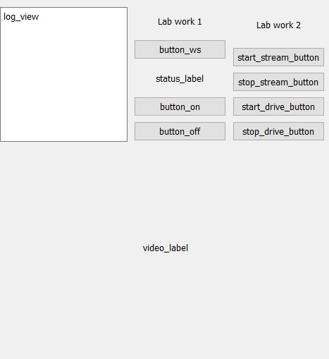

# Звіт до лабораторної роботи №2
# з дисципліни "Робототехніка та інтелектуальні системи"

**Виконав:**
Студент групи ПК-51мп
Погорєлов Богдан

**Прийняв:**
Момот А. С.

**Національний технічний університет України
"Київський політехнічний інститут імені Ігоря Сікорського"
2025**

---

## Тема: Розробка системи автономного руху робота-платформи за лінією з використанням комп'ютерного зору

### Мета роботи

Набуття практичних навичок з розробки систем комп'ютерного зору для керування мобільними роботами в реальному часі. Створення графічного інтерфейсу користувача (GUI) на PyQt для моніторингу та керування. Організація розподіленої взаємодії між ПК (обробка відео), ESP32-CAM (трансляція відео та комунікація) та Arduino Uno (керування двигунами) для реалізації автономного руху за лінією.

### Обладнання та Програмне Забезпечення

1. **Апаратне забезпечення:**
   * Мікроконтролер ESP32-CAM (для трансляції відео та Wi-Fi комунікації).
   * Мікроконтролер Arduino Uno (для керування двигунами).
   * Драйвер двигунів (напр., L298N).
   * Роботизована платформа: шасі, два двигуни постійного струму, колеса.
   * ПК для запуску керуючого ПЗ.

2. **Програмне забезпечення:**
   * Середовище Arduino IDE для програмування ESP32 та Arduino.
   * Python 3.x на ПК.
   * Бібліотеки Python: `PyQt5`, `opencv-python`, `websockets`, `aiohttp`, `qasync`, `numpy`.

### Архітектура системи

Система є розподіленою і складається з трьох основних компонентів:

1. **ПК (Керуючий вузол):**
   * Запускає Python-скрипт [GUI_line_tracking.py](GUI_line_tracking.py).
   * Отримує MJPEG відеопотік з ESP32-CAM через HTTP.
   * Обробляє кожен кадр за допомогою OpenCV для детектування лінії.
   * На основі аналізу лінії генерує керуючі команди (`w`, `a`, `d`, `halt`).
   * В автономному режимі надсилає команди на ESP32-CAM через WebSocket.
   * Відображає відеопотік та логи у GUI, створеному на PyQt5.

2. **ESP32-CAM (Проміжний вузол / Вузол зв'язку):**
   * Виконує скетч `ESP32_CAM_video_control.ino`.
   * Підключається до локальної мережі Wi-Fi.
   * Підіймає `WebServer` на порту 80 для трансляції MJPEG потоку (ендпоінт `/video`).
   * Підіймає `AsyncWebServer` на порту 81 для WebSocket зв'язку (ендпоінт `/ws`).
   * Приймає команди (`w`, `a`, `d`, `halt`) від ПК через WebSocket.
   * Перенаправляє отримані команди на Arduino Uno через апаратний `Serial1` (UART).
   * Також може надсилати логи (наприклад, повідомлення від Arduino) назад на ПК.

3. **Arduino Uno (Виконавчий вузол):**
   * Виконує скетч `ARDUINO_video_control.ino`.
   * Підключений до драйвера двигунів L298N.
   * Отримує команди від ESP32-CAM через `Serial`.
   * Функція `handleCommand` інтерпретує команди та подає відповідні сигнали (PWM та цифрові) на драйвер двигунів для керування рухом (вперед, вліво, вправо, стоп).

### Хід Роботи

#### 1. Налаштування Arduino (Виконавчий вузол)

[ARDUINO_video_control.ino](ARDUINO_video_control/ARDUINO_video_control.ino) налаштовує піни `ENA`, `ENB`, `IN1`, `IN3` як виходи для керування драйвером L298N. У головному циклі `loop()` він очікує на дані з `Serial`. Отримані команди (наприклад, "w", "a", "d", "halt") обробляються у функції `handleCommand`, яка викликає функцію `motor` для встановлення напрямку та швидкості обертання лівого та правого двигунів.

#### 2. Налаштування ESP32-CAM (Вузол зв'язку)

Скетч [ESP32_CAM_video_control.ino](ESP32_CAM_video_control/ESP32_CAM_video_control.ino) виконує наступні дії:
1. Ініціалізує `Serial` (для логів) та `Serial1` (для зв'язку з Arduino).
2. Підключається до Wi-Fi.
3. Ініціалізує камеру (з конфігурацією для AI-Thinker) у режимі `PIXFORMAT_JPEG` та `FRAMESIZE_QVGA`. Також вмикає вбудований спалах для кращого освітлення лінії.
4. Запускає `WebServer` (порт 80) з обробником `/video`, який очікує на HTTP-клієнта.
5. Запускає `AsyncWebServer` (порт 81) з обробником WebSocket `/ws`. Обробник `onWsEvent` приймає текстові повідомлення (`start`/`stop` для відео, та команди руху) і пересилає команди руху на Arduino через `sendToArduino`.
6. Запускає окрему задачу `mjpegTask` на ядрі 1, яка в циклі отримує кадри з камери (`esp_camera_fb_get`) і надсилає їх підключеному HTTP-клієнту у форматі MJPEG, доки `streamActive` має значення `true`.

#### 3. Реалізація GUI та логіки на Python (Керуючий вузол)

Скрипт [GUI_line_tracking.py](GUI_line_tracking.py) є основним керуючим додатком.
1. **Інтеграція `asyncio` та `PyQt5`:** Використовується `qasync` для запуску асинхронного циклу подій `asyncio` всередині головного циклу `PyQt5`.
2. **GUI:** Інтерфейс завантажується з файлу `ui/led_control.ui`. Кнопки "Start Stream", "Stop Stream", "Start Drive", "Stop Drive" підключаються до відповідних слотів.
3. **Мережева взаємодія:**
   * `connect_ws_loop`: Асинхронна функція, яка постійно намагається підтримувати активне WebSocket-з'єднання з ESP32.
   * `toggle_video`: Надсилає "start" або "stop" через WebSocket і запускає/зупиняє асинхронну задачу `video_stream_task`.
   * `video_stream_task`: Використовує `aiohttp` для підключення до MJPEG потоку. В циклі читає дані, знаходить JPEG кадри (між маркерами `\xff\xd8` та `\xff\xd9`), декодує їх за допомогою `cv2.imdecode` і передає у функцію `process_frame`.
4. **Обробка відео (`process_frame`):**
   * Це ядро логіки слідування за лінією.
   * Кадр перевертається на 180 градусів (`cv2.rotate`).
   * Зображення переводиться у відтінки сірого (`cv2.cvtColor`).
   * Застосовується розмиття по Гауссу (`cv2.GaussianBlur`) для зменшення шумів.
   * Використовується детектор країв Canny (`cv2.Canny`).
   * Виділяється "регіон інтересу" (ROI) - нижня половина кадру, де очікується лінія.
   * Застосовується перетворення Хафа (`cv2.HoughLinesP`) для пошуку відрізків ліній у ROI.
   * Якщо лінії знайдено, розраховується їх середній кут нахилу (`avg_angle`).
   * На основі кута генерується команда:
     * `avg_angle > ANGLE_THRESHOLD`: Поворот вліво (команда "a").
     * `avg_angle < -ANGLE_THRESHOLD`: Поворот вправо (команда "d").
     * Інакше: Рух вперед (команда "w").
   * Якщо лінії не знайдено, генерується команда "halt".
5. **Автономний режим:**
   * Кнопка "Start Drive" встановлює прапорець `self.autonomous_drive = True`.
   * Коли цей прапорець активний, розрахована у `process_frame` команда надсилається на ESP32 через WebSocket (функція `send_drive_command`).
   * Кнопка "Stop Drive" вимикає режим і надсилає команду "halt" для зупинки робота.

### Результати роботи

В результаті виконання роботи було створено програмно-апаратний комплекс, що реалізує автономний рух мобільної платформи за лінією.
1. Створено графічний інтерфейс на PyQt5, який дозволяє в реальному часі спостерігати за відеопотоком з камери робота, отримувати логи та керувати режимами роботи (запуск/зупинка трансляції, старт/стоп автономного руху).
2. Реалізовано надійну передачу відеопотоку з ESP32-CAM на ПК з використанням MJPEG через HTTP та керуючих команд у зворотному напрямку через WebSocket.
3. Налаштовано взаємодію між ESP32-CAM та Arduino Uno через UART для передачі команд керування двигунами.
4. Реалізовано та протестовано алгоритм комп'ютерного зору на базі OpenCV (Canny, HoughLinesP), який стабільно розпізнає лінію та генерує адекватні керуючі команди.

### Висновок

Під час виконання лабораторної роботи я ознайомився з методами обробки зображень в реальному часі за допомогою OpenCV та їх застосуванням для навігації мобільних роботів. Я отримав практичний досвід у розробці розподілених систем, що поєднують різні технології: Wi-Fi комунікацію (HTTP, WebSocket), міжконтролерну взаємодію (UART) та керування периферією (двигуни).

Я навчився інтегрувати асинхронні бібліотеки (`asyncio`, `aiohttp`, `websockets`) з графічним інтерфейсом PyQt за допомогою `qasync`, що є важливою навичкою для створення сучасних реактивних додатків. Створена система успішно вирішує поставлену задачу слідування за лінією, демонструючи працездатність обраної архітектури.